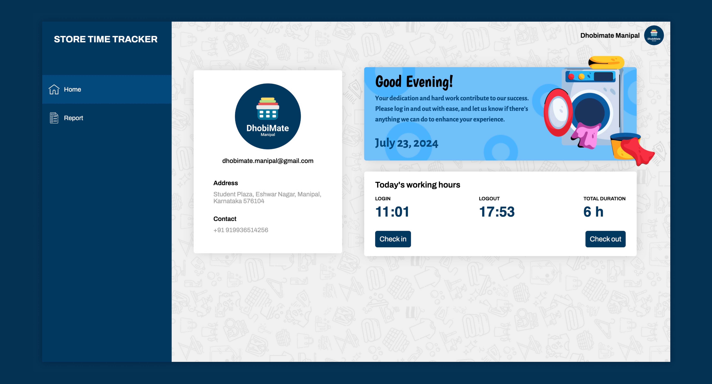

# Laundry Time Tracker

Laundry Time Tracker is a web application designed to help a laundry company track the working hours of its stores located in different locations. The application was developed using the MERN stack, which includes MongoDB, Express.js, React.js, and Node.js. The user interface (UI) and user experience (UX) design were created by me using Figma.

## Features

- **Store Management**: Easily manage the stores, including adding new stores, updating store information, and deleting stores.
- **Time Tracking**: Track the working hours of each store, including login and logout times.
- **Location-based Tracking**: Store location information is used to organize and filter time tracking data based on location.
- **User Authentication**: Secure user authentication system to ensure data privacy and access control.

## Technologies Used

- **MongoDB**: A NoSQL database for storing store and time tracking data.
- **Express.js**: A web application framework for Node.js, used for building the backend API.
- **React.js**: A JavaScript library for building the user interface.
- **Node.js**: A JavaScript runtime for building the backend server.
- **Figma**: A design tool for creating the user interface and user experience design.

## Hosted Website

You can view the live project [here](https://time-tracker-frontend-ten.vercel.app/).
